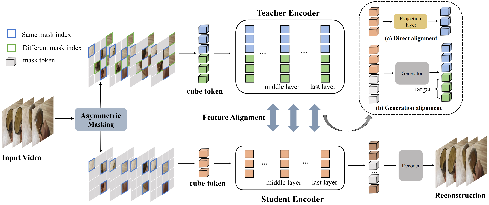

# [CVPR 2024] Official Implementation of AMD


[](https://paperswithcode.com/sota/action-recognition-in-videos-on-something?p=asymmetric-masked-distillation-for-pre)
[](https://paperswithcode.com/sota/action-recognition-in-videos-on-ucf101?p=asymmetric-masked-distillation-for-pre)
[](https://paperswithcode.com/sota/action-recognition-on-ava-v2-2?p=asymmetric-masked-distillation-for-pre)
[](https://paperswithcode.com/sota/action-recognition-in-videos-on-hmdb-51?p=asymmetric-masked-distillation-for-pre)
[](https://paperswithcode.com/sota/action-classification-on-kinetics-400?p=asymmetric-masked-distillation-for-pre)
[](https://paperswithcode.com/sota/image-classification-on-imagenet?p=asymmetric-masked-distillation-for-pre)
> [Asymmetric Masked Distillation for Pre-Training Small Foundation Models](https://arxiv.org/abs/2308.10794)<br>
> [Zhiyu Zhao](https://github.com/JerryFlymi), [Bingkun Huang](https://github.com/congee524), [Sen Xing](https://github.com/xings19), [Gangshan Wu](https://mcg.nju.edu.cn/member/gswu/en/index.html), [Yu Qiao](https://scholar.google.com/citations?user=gFtI-8QAAAAJ&hl), and [Limin Wang](http://wanglimin.github.io/)<br>
> Nanjing University, Shanghai AI Lab<br>

## News 📰
**[2024.3.27]** Code and models have been released!<br>
**[2024.2.29]** ~~Code and models will be released in the following days.~~<br>
**[2024.2.27]** AMD is accpeted by CVPR2024! 🎉🎉🎉<br>

## Main Results 🚀
### ✨ Something-Something V2

|  Method  | Extra Data | Backbone | Resolution | #Frames x Clips x Crops | Top-1 | Top-5 |
| :------: | :--------: | :------: | :--------: | :---------------------: | :---: | :---: |
| AMD |  ***no***  |  ViT-S   |  224x224   |         16x2x3          | 70.2  | 92.5  |
| AMD |  ***no***  |  ViT-B   |  224x224   |         16x2x3          | 73.3  | 94.0  |
### ✨ Kinetics-400

|  Method  | Extra Data | Backbone | Resolution | #Frames x Clips x Crops | Top-1 | Top-5 |
| :------: | :--------: | :------: | :--------: | :---------------------: | :---: | :---: |
| AMD |  ***no***  |  ViT-S   |  224x224   |         16x5x3          | 80.1  | 94.5  |
| AMD |  ***no***  |  ViT-B   |  224x224   |         16x5x3          | 82.2  | 95.3  |

### ✨ AVA 2.2

|  Method  |  Extra Data  | Extra Label | Backbone | #Frame x Sample Rate | mAP  |
| :------: | :----------: | :---------: | :------: | :------------------: | :--: |
| AMD | Kinetics-400 |   &cross;   |  ViT-B   |         16x4         | 29.9 |
| AMD | Kinetics-400 |   &check;   |  ViT-B   |         16x4         | 33.5 |

### ✨ UCF101 & HMDB51

|  Method  |  Extra Data  | Backbone | UCF101 | HMDB51 |
| :------: | :----------: | :------: | :----: | :----: |
| AMD | Kinetics-400 |  ViT-B   |  97.1  |  79.6  |

### ✨ ImageNet-1K
|  Method  |  Extra Data  | Backbone | Resolution | Top-1 |
| :------: | :----------: | :------: | :----: | :----: |
| AMD | ***no***  |  ViT-S   |  224x224  |  82.1  |
| AMD | ***no***  |  ViT-B   |  224x224  |  84.6  |
## Installation 🔨

Please follow the instructions in [INSTALL.md](docs/INSTALL.md).

## Data Preparation ➡️

Please follow the instructions in [DATASET.md](docs/DATASET.md) for data preparation.

## Pre-training 🔄

The pre-training instruction is in [PRETRAIN.md](docs/PRETRAIN.md).

## Fine-tuning ⤴️

The fine-tuning instruction is in [FINETUNE.md](docs/FINETUNE.md).

## Model Zoo 📍

We provide pre-trained and fine-tuned models in [MODEL_ZOO.md](docs/MODEL_ZOO.md).

## Acknowledgements 👍


This project is built upon [VideoMAEv2](https://github.com/OpenGVLab/VideoMAEv2) and [MGMAE](https://github.com/MCG-NJU/MGMAE). Thanks to the contributors of these great codebases.
## Citation ✏️

If you find this repository useful, please use the following BibTeX entry for citation.

```latex
@misc{zhao2023amd,
      title={Asymmetric Masked Distillation for Pre-Training Small Foundation Models}, 
      author={Zhiyu Zhao and Bingkun Huang and Sen Xing and Gangshan Wu and Yu Qiao and Limin Wang},
      year={2023},
      eprint={2311.03149},
      archivePrefix={arXiv},
      primaryClass={cs.CV}
}
```
